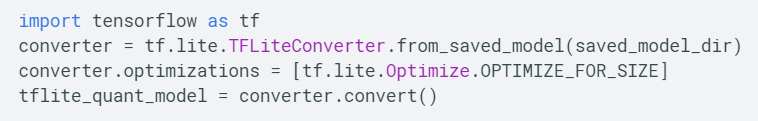
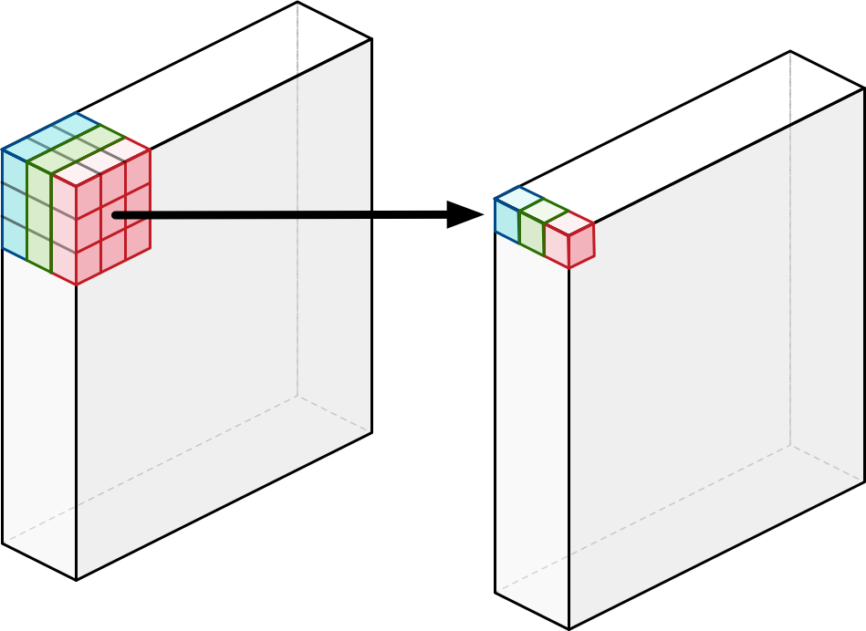

# Global AI Bootcamp 2019 
## Content - Intermediate
## What is that of cuantize models of Deep Learning?
### Requirements for the Lab 
1. Ananconda
    - Instalation: https://www.anaconda.com/distribution/
    - Conda commands to create local env: ```conda create -n myenv python=3.5```
    - Once the env have been installed succefully we need to install by pip: ```pip install azureml-sdk[notebooks,automl]```
3. Azure CLI. https://docs.microsoft.com/es-es/cli/azure/install-azure-cli-windows?view=azure-cli-latest
4. Active Azure Subscription

### Projects


 1. Glyphreader - Tensorflow 2.0 and Scikit Learn

 Classified class for follow Gardiner dictionary |  Show detected classes
:-------------------------:|:-------------------------
  |  

 2. Glyphdetector - Tensorflow Object detection API SSD Mobilenet V1 Quantized
 
 
 3. IoT Module to deploy on Azure IoT Edge

 #### Models -> https://drive.google.com/drive/folders/1na_3P_3_RuLtmaJwTBf6xU7grDKsifwE?usp=sharing

 glyphstflite put on module `glyphdetection\IoT-Glyphs\src\modules\ml_predictive\app\model` folder
 feature.npy, label.npy and lg.pkl on glyphreader project `preprocessing/models`

 ### See video

 https://youtu.be/XiwuH-eKnCY

## Questions and/or Suggestions
If there is any part of this that is hard to understand please
add an issue to the repo! Would love to make this super easy to
understand. My personal opinion is that everyone can understand
the rudiments of what is happening!

# Madrid13 December 2019

# ¿Qué es eso de cuantizar modelos?

AlexanderGonzalez

AI SoftwareEngineer– Plain Concepts

@alexndrglez

# AGENDA

* <span style="color:#D6532B"> __¿Que es la Cuantización__ </span>  <span style="color:#D6532B"> __?__ </span>
  * TensorflowLite \(Post\-training quantization
  * Quantization\-aware training
  * Model Optimization
  * RequisitosTF Lite


* <span style="color:#D6532B"> __Coral Dev__ </span>  <span style="color:#D6532B"> __Board__ </span>
  * Dev Board and Accelerator
  * MDT Flash
  * Características
  * ¿Que es TPU?

# 


* <span style="color:#D6532B"> __Demo 1__ </span>
  * Glyphs Paper Dataset
  * MobilenetV2
  * Training/Test
  * ConversiónTFLite
  * Compilación Edge TPU
  * Inferencia Coral DevBoardTPURuntime

* <span style="color:#D6532B"> __Demo 2__ </span>
  * CI/CD Raspberry Pi \(IoT Edge\)

# Why do we care?

# How it works?


TensorFlow Lite is TensorFlow’s lightweight solution for mobile and embedded devices\.

It lets you run machine\-learned models on mobile devices with low latency\, so you can take advantage of them to do classification\, regression or anything else you might want without necessarily incurring a round trip to a server\.

# Model Optimization

* Quantizing deep neural networks uses techniques that allow for reduced precision representations of weights and\, optionally\, activations for both storage and computation\. Quantization provides several benefits:
  * <span style="color:#D6532B">Support on existing CPU platforms\.</span>
  * <span style="color:#D6532B">Quantization of activations reduces memory access costs for reading and storing intermediate activations\.</span>
* TensorFlow Lite provides several levels of support for quantization:
  * <span style="color:#D6532B">TensorFlow Lite post\-training quantization quantizes weights and activations post training easily\.</span>
  * <span style="color:#D6532B">Quantization\-aware training allows for training of networks that can be quantized with minimal accuracy drop\, this is only available for a subset of convolutional neural network architectures\.</span>


# Post-training quantization

* <span style="color:#D6532B">Quantizing weights</span>
* <span style="color:#D6532B">Full integer quantization of weights and activations</span>
* <span style="color:#0078D5">https://www\.tensorflow\.org/lite/performance/quantization\_spec</span>
* <span style="color:#D6532B">Model accuracy</span>
  * It is important to check the accuracy of the quantized model to verify that any degradation in accuracy is within acceptable limits\. If the accuracy drop is too high\, consider using quantization aware training



# Quantization-aware training - Generating fully-quantized models


# Model requirements

* <span style="color:#D6532B">Tensor parameters are quantized \(8\-bit fixed\-point numbers\)</span>
  * You must use quantization\-aware training \(post\-training quantization is not supported\)\.
* <span style="color:#D6532B">Tensor sizes</span>
  * They are constant at compile\-time \(no dynamic sizes\)
* <span style="color:#D6532B">Model parameters</span>
  * Such as bias tensors are constant at compile\-time
* <span style="color:#D6532B">Tensors are either 1\-\, 2\-\, or 3\-dimensional</span>
  * If a tensor has more than 3 dimensions\, then only the 3 innermost dimensions may have a size greater than 1\.
* <span style="color:#D6532B">The model uses only the operations supported by the Edge TPU</span>
  * Logistic\,Relu\, Tanh\, AveragePool2d…etc


Discovertheancientssecrets

<span style="color:#D6532B"> __Features__ </span>  <span style="color:#D6532B"> __& training  flow__ </span>

__Gardiner List of__  __Egypts__  __Glyphs__

In this first development flow\, we will have as main tasks\, obtaining a dataset such as the Gardiner List\. Then the preprocessing of the images of the data set\. Extraction of characteristics of the preprocessed images and finally the corresponding training\, testing and evaluation\.

__Preprocess Images__

__Preprocessing images  with resize\, crops\,__  __ligthning__  __analysis\, blur or__  __smootthing__  __…__  __etc__

__Extract features__

__With__  __Keras__  __and__  __tensorflow__  __network we extract the features of the__  __preprocesed__  __images and get the__  __correspont__  __labels for each one to package them for the training phase__

__Training\, testing and evaluation__

# Dataset


# Mobilenet V1 Quantized





# 

# Coral Dev Board


# Features


* Edge TPU System\-on\-Module \(SoM\)
  * NXP i\.MX 8M SoC \(Quad\-core Cortex\-A53\, plus Cortex\-M4F\)
  * Google Edge TPU ML accelerator coprocessor
  * Cryptographic coprocessor
  * Wi\-Fi 2x2 MIMO \(802\.11b/g/n/ac 2\.4/5GHz\)
  * Bluetooth 4\.1
  * 8GB eMMC
  * 1GB LPDDR4
* USB connections
  * USB Type\-C power port \(5V DC\)
  * USB 3\.0 Type\-C OTG port
  * USB 3\.0 Type\-A host port
  * USB 2\.0 Micro\-B serial console port
* Audio connections
  * 3\.5mm audio jack \(CTIA compliant\)
  * Digital PDM microphone \(x2\)
  * 2\.54mm 4\-pin terminal for stereo speakers
* Video connections
  * HDMI 2\.0a \(full size\)
  * 39\-pin FFC connector for MIPI DSI display \(4\-lane\)
  * 24\-pin FFC connector for MIPI CSI\-2 camera \(4\-lane\)
* MicroSD card slot
* Gigabit Ethernet port
* 40\-pin GPIO expansion header
* Supports Mendel Linux \(derivative of Debian\)

# MDT (Mendel Development Tool)


<span style="color:#D6532B">Mendel</span>  <span style="color:#D6532B">Development</span>  <span style="color:#D6532B">Tool \(</span>  <span style="color:#D6532B">mdt</span>  <span style="color:#D6532B">\)</span>

Is a command\-line tool that lets you communicate with a device running Mendel Linux

The ”mdt” command facilitates a variety of device actions such as opening a shell\, installing Debian packages\, pushing and pulling files\, and more\.

# TensorFlow models on the Edge TPU

* <span style="color:#FF5E4D">What is TPU?</span>
  * <span style="color:#767171">Tensor Preprocessor Unit</span>
* <span style="color:#FF5E4D">What is Edge TPU?</span>
  * <span style="color:#767171">Google chip designed to run machine learning \(ML\) models for</span>  <span style="color:#767171">edge computing</span>  <span style="color:#767171">\. Google Cloud bring us the possibility to use it\.</span>
  * <span style="color:#767171">The Edge TPU can execute deep feed\-forward neural networks such as convolutional neural networks \(CNN\)\.</span>
  * <span style="color:#767171">It supports only TensorFlow Lite models that are fully 8\-bit quantized and then compiled specifically for the Edge TPU\.</span>


# TPU COMPILER


# 

CI/CD Raspberry Pi

# CI/CD


# Madrid13 December 2019

